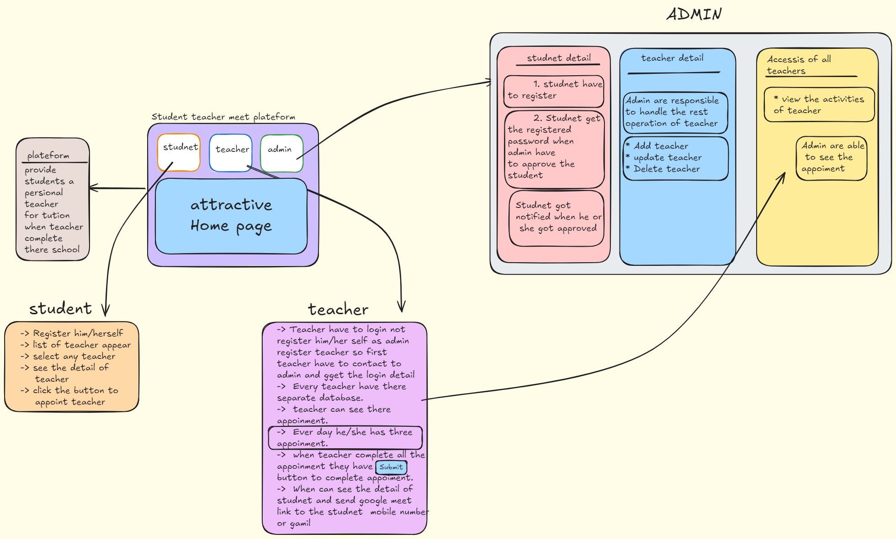

> flow Chart


# Student-Teacher Booking Appointment System

This is a MERN stack project designed to facilitate the booking of appointments between students and teachers. The system includes functionalities for admins to manage teachers, for teachers to manage their appointments, and for students to book appointments with teachers.

## Table of Contents
- [Features](#features)
- [System Modules](#system-modules)
  - [Admin](#admin)
  - [Teacher](#teacher)
  - [Student](#student)
- [Tech-Stack-Used](#tech-stack-used)
- [Installation](#installation)
- [Usage](#usage)
- [Screenshots](#screenshots)
- [Login Acess](#login)
- [Contributing](#contributing)

## Features
- Admin management for adding, updating, and deleting teachers and approving student registrations.
- Teacher functionalities for managing their appointment schedules, approving/cancelling appointments, sending email alerts to students, viewing messages, and viewing all appointments.
- Student functionalities for registering, booking appointments with teachers, sending email alerts to teachers, and sending messages.

## System Modules

### Admin
- Add Teacher (Name, Department, Subject, etc.)
- Update/Delete Teacher
- Approve Registration Student

### Teacher
- Login
- Schedule Appointment
- Approve/Cancel Appointment
- Send Email Alerts to Students
- View Messages
- View All Appointments

### Student
- Register
- Login
- Book Appointment
- Send Email Alert to Teacher
- Send Message

## Tech-Stack-Used

**Frontend**
```bash
vite (bundler-react)
tailwindcss (styling)
react-icons (icons)
react-router-dom (routing)
react-toastify (notify)
axios (API)
```
**Backend**
```bash
express (API)
jwt-token (token)
nodemail (MAIL)
bcrypt (encryption)
```

## Installation

To run this project locally, follow these steps:

1. **Clone the repository:**
    ```bash
    git clone [https://github.com/SpandanL96/Student-Teacher-Booking-Appointment-]
    ```

2. **Install backend dependencies:**
    ```bash
    cd backend
    npm install
    ```

3. **Install frontend dependencies:**
    ```bash
    cd frontend
    npm install
    ```

4. **Set up environment variables for the backend:**

    Create a `.env` file in the `backend` directory with the following content:
    ```env
    DB_URL=''
    JWT_KEY = ''
    PORT = 5000

    # mail integration 

    MAIL_HOST = smtp.gmail.com
    MAIL_USER = 'your_mail'
    MAIL_PASS = 
    ```

5. **Run the backend server:**
    ```bash
    cd backend
    npm run dev
    ```

6. **Run the frontend server:**
    ```bash
    cd frontend
    npm run dev
    ```
7. **Set up environment variables for frontend:**

    Create a `.env.local` file in the `frontend` directory with the following content:
    ```env
    VITE_BACKEND_URL='http://localhost:5000'
    ``` 

The application should now be running on `http://localhost:5173/`.

## Usage

1. **Admin:**
    - Log in to the admin dashboard.
    - Add, update, or delete teachers.
    - Approve student registrations.

2. **Teacher:**
    - Log in to the teacher portal.
    - Schedule, approve, or cancel appointments.
    - Send email alerts to students.
    - View messages and all appointments.

3. **Student:**
    - Register and log in to the student portal.
    - Book appointments with teachers.
    - Send email alerts and messages to teachers.

## Screenshots

<h1>Landing Page </h1>


<div>
  </div>
<h4>1.Getting Started with Student and Teacher Login Page</h4>


<div>
  </div>
<h4>2.Template Page For Interactive Look</h4>


<div>
  </div>
  
<h1>Student Dashboard</h1>
<div>
  </div>
<h4>1.Student Registration</h4>


<div>
 </div>
<h4>2.Student Login</h4>


<h1>Teacher Dashboard</h1>
<div>
  </div>
<h4>Teacher Login</h4>


<div>
  </div>

<h1>Admin Dashboard</h1>
<div>
  </div>
<h4>1.Admin Login</h4>


<div>
</div>
<h4>2.Adding Teacher Details</h4>


<div>
 </div>
<h4>3.Updating Teacher Details</h4>


<div>
  </div>
<h4>4.Deleting Teacher Details</h4>


<div>
  </div>
<h4>5.List of Teacher Available</h4>


<div>
 </div>
<h4>6.List of Students</h4>


## Login

**Student**
 ```bash
name: dinesh
class: 12
school: holy christ
phone: 8763474398
email: xyz@yahoo.com
Password: 571909
 ```
**Teacher**
 ```bash
name: hitesh
Password: 872920
 ```
**Admin**
 ```bash
email: admin123
Password: admin123  
 ```
**Note: Don't Spam**

## Contributing

Contributions are welcome! Please follow these steps:

1. Fork the repository.
2. Create your feature branch: `git checkout -b feature/YourFeature`
3. Commit your changes: `git commit -m 'Add some feature'`
4. Push to the branch: `git push origin feature/YourFeature`
5. Open a pull request.

## Thank You 

**Keep Coding**

